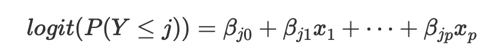
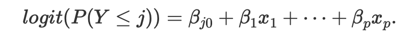
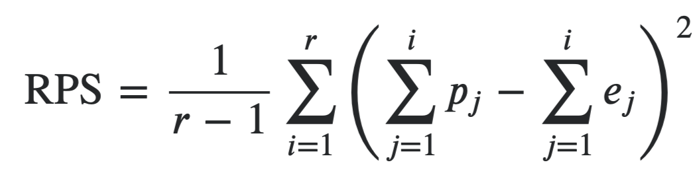

```{r setup, include=FALSE}
knitr::opts_chunk$set(echo = TRUE)
require(DT)
require(dplyr)
require(readxl)
Scenarios <- read_excel("Scenarios.xlsx")
load("ResultSummary.rdata")
```

<style>
    body .main-container 
    {
    max-width: 1500px;
    }
</style> 

## 1. Introduction

<br />  


#### 1.1 Problem Description

Football is one of the most popular sports around the world and therefore it is also a global industry. The industry is improving with technological innovations considering both players or referees such as video assistant referee and electronic performance and tracking systems. Besides the investments on improving the game's itself, there is a significant interest for the sports forecasting. Especially with the increasing amount and type of data collected, betting market has grown rapidly in the last decade (Herbinet, 2018). 

The significant increase in the available data also introduces new challenges about the effective usage of this information. In this project, it is aimed to understand the behavior of different betting companies and leagues with the use of available information from different sources. The focus of the project is to provide better forecasts for 1x2 bets (i.e. home, tie, away) compared to bookmakers using the odds data and other type information we can come up with. To achieve this, we are asked to provide the predicted probabilities for the outcomes of several English Premier League matches by using a large data from various bookmakers and the data of previous matches.

<br />  

#### 1.2 Summary of the Proposed Approaches

Our problem can be considered as a classification problem with three labels (home, tie away) but it is an ordinal regression problem because of the nature of the target class. Because it is a multiclass and ordinal regression problem, we tried to find the most relevant methods in addition to the methods we have learnt in the class. 

As Goller *et al.* (2018) mentioned in their studies that oddmakers provides good probabilities since bet companies constantly analyze every aspect of teams including newest events and statuses of players and all related variables, we initially tried to analyze the bet odds and their implied probabilities as our naive approach. So, we analyzed their odds and try to find outcome probabilities based on their probability. Since the first rounds of submissions were early, we were not ready to construct our ML models. Meanwhile, we tried to find minimum RPS among the bet companies.We continued with this approach until the RPS values of our later models exceed the RPS value obtained via naive approach which was around 0.20. The details of this naive approach will be given later in this report.

Then, we decided to use GLM with regularization method with both lasso and ridge regression, and also the elastic net as the combination of ridge and lasso regression. Furthermore, we saw during the literature review that multinomial logistic regression is also preferred for multiclass regression problems. Since our problem is an ordinal regression problem, we also worked on ordinal logistic regression model. Similarly, we used Random Forest as mentioned in the literature review that it provides good results. Additionally, we searched about Ordinal Forest to adapt it to our problem. A brief information about those extended versions of logistic regression and random forest will be given in the Approach section.

<br />  


#### 1.3 Descriptive Analysis of the Given Data

We have been given five different data files which stores the information about soccer games played in 6 leagues from October 15th, 2018 till today to utilize within this project. Their contents are summarized below. We utilized not all the information provided but some parts which we considered as significant.

Data  | Content
------------- | -------------
Match Information   | match id, epoch, status, live, hometeam, awayteam, scores, halftime scores, extra scores, penalty scores
Bet Information     |  match id, bookmakers, epoch, odd type, odd value 
Match Statistics    |  statistics related to the finished matches (posession, corner kicks, goal attempts, blocked shots, attacks, saves etc.)
Goal Information    |  match_id, time, score, home scorer, away scorer
Booking Information    |  information about the yellow/red cards for finished matches (time, home or away fault, card)

## 2. Related Literature

In the literature review, we mainly focused on the recent studies since the machine learning approaches are getting improved day by day. We reviewed the commonly used algorithms and selected features. Then, we tried to have insights especially about the ML algorithms that we covered during class.

**Adam (2016)** built a generalized linear model with L2 regularization to predict the score of a match. Their model is built on both player-based, using a randomized approach to select the players based on their past selections, and team-based features which are obtained from FIFA, UEFA and ELO ratings of the teams. 

Logistic regression algorithms are commonly preferred ML algorithms in predicting the results of football matches. **Prasetio and Harlili (2016)** proposed a logistic regression model to predict who is going to win a match (home/away), and give information on the odds, probability, and the regression coefficients. They used four variables as Home Offense, Home Defense, Away Offense, and Away Defense. **Pescier (2016)** investigated whether the wisdom of the crowd effect can be found with the market values. He used multinomial logistic regression and compared the predictions of the market with models based on the ELO ratings and the predictions of bookmakers. Other than multinomial logistic regression, ordinal logistic regression is frequently used in modeling the outcomes of football matches since it accounts the natural hierarchy of outcomes. **Sillanpää and Heino (2013)** developed an ordinal logistic regression model to forecast football results and assessed the model’s performance with forecast accuracy measurements and betting simulations. The principal idea of the model is based on the ELO rating system which assigns relative performance ratings to teams. They concluded as the publicly quoted odds for extensively betted football matches are slightly inefficient and historical league match results are the most important components of a statistical football forecast model. On the other hand, **Hvattum (2017)** showed that multinomial logit regression is a viable alternative to ordered logistic regression when independent variables related to the probability of draws are present.

Forest based algorithms are also frequently used ML algorithms other than ANN and SVM. **Herbinet (2018)** developed an expected goals metric and combined it with a calculation of a team’s offensive and defensive ratings which are updated after each game and used to build a classification model predicting the outcome of future matches, as well as a regression model predicting the score of future games. They used Neural Networks, Random Forest and Support Vector Machines techniques to generate match outcome and match score predictions. Their models’ performance compared favorably to existing traditional techniques and achieved a similar accuracy to bookmakers’ models. **Hucaljuk and Rakipović (2011)** used many learning algorithms including Random Forest which is the most popular decision tree algorithm. Their results can be considered satisfying especially when using artificial neural networks. **Baboota and Kaur (2018)** created a feature set for determining the most important factors for predicting the results of a football match. They used Attack, Midfield, Defense and Overall ratings, goal differences, corners, shots on target and goals for the respective teams. They also suggested that the home/away factor is an important characteristic of the problem. Their best performing model was the gradient boosting model, followed by the Random Forest. **Kumar (2013)** used around 15 algorithms including function, tree or rule-based algorithms. The best subset of ratings attributes is composed of team average ratings, difference of average attackers’, defenders’, midfields’ and goalkeepers’ ratings and, maximum ratings for attacker for both home and away teams. He also highlighted that the outcome of a soccer match is highly correlated with the “current match performance ratings only” and the past performance ratings of the player have very less influence. Similar to the case in logistic regression, the need of modeling for ordered categorical outcomes led to the Ordinal Forest algorithm. **Goller et al. (2018)** predicted the probabilities for a draw, a home win, and an away win, for the games of the German Football Bundesliga based on more than 10 years of data on game outcomes as well as extensive information about teams, their players, and their environment by using Ordinal Forest Estimator. They compared their game predictions to the ones of the betting firms, which use a much more up-to-date information set. They found that they are surprisingly close, and they can form even strategies that outperform them for the current season. 


## 3. Approach

<br />   

#### 3.1 Feature Engineering

We didn't utilize the provided odd values from the bookmakers in our models other than the naive approach to be able to compare the performance of our model with the bookmakers' models. Since it is highlighted in Kumar (2013), late historic data does not contribute to the model, we used at most 5 last matches' information in our features. 

Initially, we created features given below. Same features are created for both home and away team and distinguished by starting or ending of their names. Features starts with **H_** are related to home team and the ones with **A_** are related to the away team. Other important thing to distinguish features is that very end of the names differs as follows:

* **Last3HomeGames:** Feature based on home team's last 3 home games. Present only for home team.
* **Last3AwayGames:** Feature based on away team's last 3 away games. Present only for away team.
* **Last5Games:** Feature based on last 5 games(home or away). Present for both home and away team.
* **Empty:** Feature based on last game(home or away). Present for both home and away team.

**Initial features included in the model: **

*If a feature is based on last 3 or 5 games, there is Avg_ at the beginning of it which means the mean of last 3 or 5 games' related measure.* 

* **..._Score_...:** Goals that related team scored in corresponding games.
* **..._Opponent_Score_...:** Goals that related team gave away in corresponding games.
* **..._GoalKeeperPerformance_....: ** Performance of goal keeper of related team in corresponding games. Which is the ratio of the shots saved by goal keeper to the shots on goal.
* **..._AttackingPower_...:** This is a distinctive feature of our own. Calculated using **Score**, **CornerKicks**, **GoalAttempts**, **ShotsOnGoal** and **BallPossesion**. We take 95th percentile as their max (above values are drawn to this max) and we scale them between 0-1. Then we take maximum 4 of these 5 variables and calculate the area of diamond shape these 4 variables defines. It is like each variable represents one of x+, x-, y+ and y- on the coordinate system and the corners of the diamond is represented by one of the variables.

**Features included in time: **

* **..._Win_...:** The number of wins that of the related team in corresponding games.
* **..._WinDraw_...:** The number of wins or drawa that of the related team in corresponding games.
* **..._WinStreak_...:** The number of consecutive wins of the related team in corresponding games.
* **..._WinDrawStreak_...:**  The number of consecutive wins or draws of the related team in corresponding games. 

**The last features to tune the models: **

* **..._Elo_:**    ELO rating of the related team. There are three season in the calculation of ELO ratings and we decrease the variance by half at the beginning of second and third seasons.

**In this way, we had 34 features in total. **

<br />  

#### 3.2 Model Construction

In this project we have consider 5 different models as listed below.

1. GLM with Regularization (Lasso, Ridge and Elastic-net)
2. Multinomial Logistic Regression
3. Ordinal Logistic Regression  
4. Random Forest
5. Ordinal Forest 

GLM and Random Forest are covered in class. The additional information about the remanining models are given below.

**Multinomial Logistic Regression** is a classification method that generalizes logistic regression to multiclass problems, i.e. with more than two possible discrete outcomes. In multinomial logistic regression, the log odds of the outcomes are modeled as a linear combination of the predictor variables. The *multinom()* function is used for this model. Detailed information about the model and used methods can be found from [here](https://stats.idre.ucla.edu/r/dae/multinomial-logistic-regression/).

**Ordinal Logistic Regression** is used to predict an ordinal dependent variable which can be considered as either a generalisation of multiple linear regression or binomial logistic regression. The underlying model for $j=1... J$  and *p* predictors is given as following:

```{r, out.width = "400px", echo=FALSE, fig.align="center"}

```

Due to the parallel lines assumption, the intercepts are different for each category but the slopes are constant across categories, which simplifies the equation above to

```{r, out.width = "400px", echo=FALSE, fig.align="center"}

```

The *polr()* function is used for this model. Detailed information about the model and used methods can be found from [here](https://stats.idre.ucla.edu/r/dae/ordinal-logistic-regression/).

**Ordinal Forest** is a random forest based prediction method for ordinal response variables. Ordinal forests allow prediction using both low-dimensional and high-dimensional covariate data and can additionally be used to rank covariates with respect to their importance for prediction. The *ordfor()* function is used for this model. Detailed information about the model and used methods can be found from [here](https://cran.r-project.org/web/packages/ordinalForest/ordinalForest.pdf).

##### Test Development Environment:
We wanted to conduct a comprehensive analysis on the ML algorithms we decided on. To achieve it, we needed an efficient envorinment for parameter analysis and feature combinations which will also allow us to track the history of our study. Therefore, we created a test development environment in which we enumerate our scenarios with 5 different methods, different parameter settings and feature subsets. We begin to work on the model with features also used in the 4th homework and continue to add new features in time. As the general method, we created scenarios with both including all the features created and also the subsets of the features. In this way we tracked how the model improves and which features are more important. We also took the variable importances into account while constructing different scenarios.

A preview from our test development can be found below with the explanations for parameters used in the models. 

```{r , include=TRUE,warning = FALSE,message=FALSE, echo=FALSE}

Scenarios%>%
  DT::datatable(
    extensions = 'Buttons', 
    options = list(dom = 'Bfrtip'
                   ,scrollX = T
                   ,buttons = c('excel', "csv")))

```

<br />  

#### 3.3 Performance Evaluation Metrics

We used Ranked Probability Score (RPS) as our performance evaluation metric. It is a measure of how good forecasts, expressed as probability distributions, match with observed outcomes. Both the location and spread of the forecast distribution are taken into account in judging how close the distribution is to the observed value.

```{r image_grobs,out.width = "400px", echo=FALSE, fig.align="center"}

```

We have calculated RPS values for the results both obtained from test and train data to analyze models' performances.

## 4. Results

The model parameters are chosen with cross validations based on their performances on test data. Furthermore, we randomly seperated the instance set 3 times with 80-20 ratio. Then within a loop (1st, 2nd and 3rd train-test split), every model trains itself using train data and predicts both train and test data. The results given below are the average of the results of models with three different set. In this way, we used same training and test data sets for each scenario and it is possible to compare the different models with different factor subsets.

We had 77 different scenarios in total. The RPS values of train and test data and their differences can be seen for all of the scenarios below.

```{r , include=TRUE,warning = FALSE,message=FALSE, echo=FALSE}
ResultSummary%>%
  DT::datatable(
    extensions = 'Buttons', 
    options = list(dom = 'Bfrtip'
                   ,scrollX = T
                   ,buttons = c('excel', "csv")))

```

## 5. Conclusions and Future Work

The lowest RPS values for each algorithm are following:

* Glmnet with L2 regularization: **0.20708** (Scenario ID:53)
* Random Forest: **0.207656** (Scenario ID:59)
* Multinomial Logistic Regression: **0.208112** (Scenario ID:58)
* Ordinal Logistic Regression: **0.20815** (Scenario ID:63)
* Ordinal Forest: **0.209271** (Scenario ID:62)

The lowest RPS_Test values are achieved as 0.20708 with a glmnet model with scenario ID 53 and as 0.20738 with also a glmnet model with scenario ID 64. Note that in those models train and test RPS values are close to each other which indicates that there is no overfitting which is a good sign for those models. From these two models, it is better to choose the model given with scenario ID 64 because it uses a subset of the features while the model with scenario ID 53 uses all of the features which may cause problems with higher dimension of instance sets.

It can also be seen from the results given above that we obtained RPS values in the range of **0.2070-0.21** with 18 scenarios in total and also by using other ML algorithms used in this project which are Multinomial Logistic Regression, Ordinal Logistic regression, Random Forest and Ordinal Forest. However, the RPS values for training data is much smaller than their RPS values for test data in Random Forest and Ordinal Forest algorithms. Therefore, we can conclude that those algorithms are overfitting. 

As we came to the results for selected features,  we observed that the best models of each different method is obtained with the following **12 features** in general:

* H_Avg_GoalKeeperPerformance_Last3HomeGames
* A_Avg_GoalKeeperPerformance_Last3AwayGames
* H_Avg_AttackingPower_Last3HomeGames
* A_Avg_AttackingPower_Last3AwayGames
* H_Avg_AttackingPower_Last5Games
* A_Avg_AttackingPower_Last5Games
* A_WinDrawStreak_Last3AwayGames
* H_WinDrawStreak_Last3HomeGames
* A_Avg_Win_Last5Games
* H_Avg_Win_Last5Games
* H_Elo
* A_Elo

As a future study, we can work on enriched data including the list of the players, or player-centered metrics since the characteristics and compliance of the players may affect the results. It is also possible to use different ML algorithms such as gradient boosting method. 

## 6. Code

The codes for both [naive approach](https://github.com/ceyonur/ie582-project/blob/master/naive_approach/naive_approach.html) and the main five [ML algorithms](https://github.com/ceyonur/ie582-project/tree/master/Codes) can be reached from the given Github links. 

## 7. References

Adam, A. (2016). Generalised Linear Model for Football Matches Prediction. MLSA@PKDD/ECML.

Baboota, R., Kaur, H. (2018) Predictive analysis and modelling football results using machine learning approach for English Premier League. International Journal of Forecasting. https://doi.org/10.1016/j.ijforecast.2018.01.003. 

Goller, D., Knaus, M. C., Lechner, M., Okasa, G. (2018) Predicting Match Outcomes in Football by an Ordered Forest Estimator. Economics Working Paper Series 1811, University of St. Gallen, School of Economics and Political Science.

Herbinet, C. (2018) Predicting Football Results Using Machine Learning Techniques. Individual Project Report. Imperial College of Science, Technology and Medicine. 

Hucaljuk, J. and Rakipović, A. (2011) Predicting football scores using machine learning techniques. Proceedings of the 34th International Convention MIPRO, Opatija, 2011, pp. 1623-1627.

Hvattum, L. M. (2017) Ordinal versus nominal regression models and the problem of correctly predicting draws in soccer. International Journal of Computer Science in Sport. Volume 16/1, pp 50-64.  Doi: https://doi.org/10.1515/ijcss-2017-0004

Kumar, G. (2013) Machine Learning for Soccer Analytics. Thesis for: Master of Science in Artificial Intelligence (option Engineering and Computer Science). Doi: 10.13140/RG.2.1.4628.3761

Pescier, F. (2016) The Wisdom of the Crowd: Predicting Domestic Football Matches Using Crowd Estimated Market Values. Master Thesis. Behavioural Economics, Erasmus University of Economics. 

Prasetio, D., Harlili, D. (2016). Predicting football match results with logistic regression. International Conference On Advanced Informatics: Concepts, Theory And Application (ICAICTA), George Town, pp. 1-5. Doi: 10.1109/ICAICTA.2016.7803111

Sillanpää, V., Heino, O. (2013) Forecasting football match results - A study on modeling principles and efficiency of fixed-odds betting markets in football. Master’s Thesis. Aalto University School of Business, Department of Information and Service Economy.


